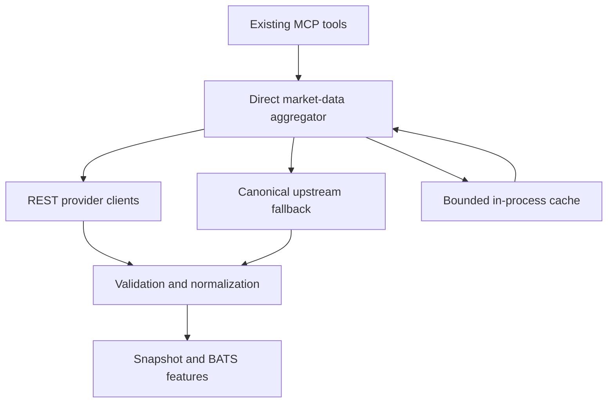

# Design: REST Market Data Completeness

Status: Draft

## Design goals

- Make Binance Spot, Hyperliquid perpetual context, Coinalyze liquidation aggregates, and
  Deribit options directly available through request-driven REST calls owned by this MCP.
- Preserve all twelve existing tool names, inputs, defaults, and response fields while adding
  normalized spot and provider-quality fields.
- Keep the MCP stateless across processes: no Redis, PostgreSQL, other database, durable cache,
  background collector, or scheduled job; only bounded ephemeral in-process state is allowed.
- Make optional-provider failure narrow, explicit, source-attributed, and safe within the
  existing 15-second Vercel function duration.
- Calculate live session VWAP exactly from Binance one-minute quote and base volume without
  allowing the open bar into closed-candle indicators.
- Make CI deterministic and network-free while providing an explicit operator-run live REST
  smoke command.

## Verified technical context

| Path or source | Verified constraint or convention |
|---|---|
| `src/tools/all.ts` | Registers twelve read-only tools. Legacy snapshot assembly currently fetches and normalizes the canonical upstream before applying a direct Binance timeframe replacement. Options inputs allow 1–6 expiries and 0–50 strikes per expiry. |
| `src/clients/market-data-client.ts` | Owns the canonical upstream request, one bounded retry, and stale-if-error behavior. It remains available only for compatible fallback. |
| `src/cache/ephemeral-cache.ts` | Holds one module-local cache entry and an in-flight map. It must become a bounded keyed cache to isolate providers and request shapes without adding persistent storage. |
| `src/clients/binance-timeframes-client.ts` | Probes standard Binance hosts before `data-api.binance.vision`; this ordering must be reversed and shared with all Binance Spot requests. |
| `src/clients/historical-candles-client.ts` | Already validates direct Binance/Hyperliquid REST candles and marks open bars; its Binance transport should reuse the new endpoint policy. |
| `src/features/market-state.ts` | Session VWAP currently uses typical price × base volume over closed 5m bars. Existing anchors are daily UTC plus Asia/Europe/US under `UTC_DEFAULT` or `MYT_TRADING`. |
| `src/features/indicators.ts` | Indicator calculations already consume closed candles only and must remain unchanged in that respect. |
| `src/normalizers/snapshot.ts` | Defines the current additive snapshot shape and nullable liquidation event fields, but all derivative sections are currently attributed to the canonical upstream. |
| `src/services/bats-service.ts` | Treats execution data as core, liquidations as C1 strategy-specific, and options as optional context. |
| `src/config/env.ts` | Uses Zod for server environment validation. Only the three approved direct-provider variables may be added. |
| `.env.example`, `README.md` | Need explicit local and Vercel Production/Preview instructions for the Coinalyze secret and optional direct-provider settings. |
| `vercel.json` | The MCP function is capped at 15 seconds; the design must not increase it. |
| `package.json` | Uses Node 20+, TypeScript, Zod, and the Node test runner. No Redis/database dependency exists and none will be added. |
| [Coinalyze API](https://api.coinalyze.net/v1/doc/) | `future-markets` supplies supported contracts; `liquidation-history` accepts up to 20 comma-separated symbols, each consuming one call, supports `1min`, `convert_to_usd=true`, and returns `t`, `l`, and `s`. Authentication uses `api_key`; free rate limit is documented as 40 calls/minute/key with `Retry-After` on 429. |
| [Deribit bulk summary](https://docs.deribit.com/api-reference/market-data/public-get_book_summary_by_currency) | Returns all option summaries for a currency, including instrument, mark IV, underlying price, interest rate, and OI. |
| [Deribit ticker](https://docs.deribit.com/api-reference/market-data/public-ticker) | Returns official per-instrument IV and Greeks; ticker fan-out therefore has to be bounded after bulk candidate selection. |
| [Hyperliquid info API](https://hyperliquid.gitbook.io/hyperliquid-docs/for-developers/api/info-endpoint/perpetuals) | Public `/info` request types provide perpetual asset contexts and mid prices through REST POST requests. |
| [Binance Spot market REST](https://developers.binance.com/en/docs/catalog/core-trading-spot-trading/api/rest-api/market) | Klines are keyed by open time and expose base and quote volume; public ticker and 24h endpoints provide the remaining spot fields. |

## Proposed architecture

Existing MCP tools will submit a section plan to a single aggregation service. The service will
run only the required direct provider clients, in parallel where independent, normalize every
result into a common provider envelope, and request compatible canonical fallback only for
fields that remain missing. Coinalyze is the sole liquidation source; upstream liquidation data
is never consumed.



The aggregator is request-driven. It creates no listener, worker, cron task, durable history, or
cross-instance coordination. Provider cache entries and in-flight promises live only in module
memory and may disappear at any time.

## Components and responsibilities

| ID | Component | Responsibility | Expected change |
|---|---|---|---|
| DES-001 | `src/config/env.ts` | Validate the server-only Coinalyze key, optional liquidation symbol override, and 500–4000ms direct-provider timeout with a 4000ms default. | Modify; add only `COINALYZE_API_KEY`, `COINALYZE_LIQUIDATION_SYMBOLS`, and `DIRECT_PROVIDER_TIMEOUT_MS`. |
| DES-002 | `src/cache/ephemeral-cache.ts` | Store provider/request-shaped entries and in-flight promises in a bounded keyed in-process map. | Modify; cap entries at 64, evict expired then least-recently-used entries, expose safe per-provider metadata, and provide a test reset. |
| DES-003 | `src/clients/provider-http.ts` | Apply deadlines, safe response parsing, retry policy, `Retry-After`, response-size bounds, dependency injection, and redacted provider errors. | Create; no credential-bearing URL or raw body is logged or returned. |
| DES-004 | `src/clients/coinalyze-client.ts` | Discover supported BTC perpetuals, validate overrides, enforce symbol-weighted local budget, fetch one-minute USD liquidation history, and expose coverage. | Create; Coinalyze is the only liquidation client. |
| DES-005 | `src/features/liquidations.ts` | Validate/deduplicate buckets and calculate deterministic 5m/15m/1h long, short, and total USD aggregates. | Create; event-level fields remain null with an unsupported reason. |
| DES-006 | `src/clients/deribit-options-client.ts` | Fetch the BTC option catalog and bulk summaries, select bounded expiries/instruments, and fetch official tickers with concurrency four. | Create; at most four ticker requests per selected expiry. |
| DES-007 | `src/features/options-surface.ts` | Join instrument metadata, summaries, and selected tickers; sort/bound strikes and compute ATM IV, 25d RR, and 25d butterfly. | Create; deterministic selection and nullable partial fields. |
| DES-008 | `src/clients/hyperliquid-context-client.ts` | Fetch `metaAndAssetCtxs` and `allMids` in parallel, join BTC fields, and preserve independent field availability. | Create. |
| DES-009 | `src/clients/binance-spot-client.ts` | Apply Binance endpoint ordering; fetch ticker, 24h statistics, and paginated one-minute BTCUSDT bars from the earliest active anchor. | Create; `data-api.binance.vision` is primary and at most 2,000 1m bars are fetched. |
| DES-010 | Existing Binance clients | Reuse the shared endpoint policy and parsing rather than preserving conflicting host order. | Modify `binance-timeframes-client.ts` and `historical-candles-client.ts`; retain existing public interfaces where practical. |
| DES-011 | `src/features/market-state.ts` | Calculate exact live VWAP/session ranges from the dedicated 1m series while retaining closed-candle indicator inputs. | Modify; exact method is `sum_quote_volume_div_sum_base_volume`. |
| DES-012 | `src/services/direct-market-data-service.ts` | Execute per-tool section plans, coordinate caches/deadlines, run providers concurrently, request compatible fallback, and produce one normalized aggregate. | Create; this is the only orchestration boundary used by tools. |
| DES-013 | `src/clients/market-data-client.ts` | Retain validated canonical HTTP access for compatible fallback and legacy continuity. | Modify only as needed for safe section-aware fallback; never source liquidation output. |
| DES-014 | `src/normalizers/snapshot.ts` and direct schemas | Validate provider payloads, merge direct and compatible fallback fields, attach field/section provenance, and add `spot`. | Modify and add provider-specific Zod schemas; existing fields remain. |
| DES-015 | `src/services/bats-service.ts` | Supply exact 1m session data to BATS features and preserve completeness rules. | Modify; liquidations affect only C1 and options remain optional. |
| DES-016 | `src/tools/all.ts` | Translate each existing tool input into a section plan and return additive normalized results. | Modify; no tool name, input, default, or prior response field is removed. |
| DES-017 | Health and diagnostics | Report provider configuration, last attempt/success, latency, cache state, freshness, coverage, and safe reason. | Modify existing health output and readiness logic; optional failures do not make core readiness false. |
| DES-018 | Version constants | Identify the additive contract and calculation release. | Modify service to `1.2.0`, schema to `1.1.0`, and calculation to `bats-1.1.0`. |
| DES-019 | `.env.example` and `README.md` | Document local `.env.local`, Vercel Production/Preview variables, server-only secret handling, and stateless architecture. | Modify during implementation; never show a real key. |
| DES-020 | Provider tests and smoke command | Prove deterministic behavior without live CI calls and provide opt-in local provider validation. | Add unit/contract fixtures and `scripts/smoke-providers.ts`; expose an explicit package script. |

## Data models and state

### Provider envelope

Every direct or fallback section uses a common envelope. Individual fields that can be mixed,
such as Hyperliquid context, also carry a compact field-source map.

```ts
type ProviderStatus = "live" | "stale" | "partial" | "unavailable" | "error";
type CacheStatus = "miss" | "hit" | "stale-if-error" | "not-used";

type ProviderEnvelope<T> = {
  data: T | null;
  source: string | null;
  venue: string;
  marketType: "spot" | "perpetual" | "option" | "aggregate";
  method: string;
  sourceTimestamp: string | null;
  observedAt: string;
  receivedAt: string;
  ageMs: number | null;
  status: ProviderStatus;
  cacheStatus: CacheStatus;
  fallback: boolean;
  reason: string | null;
  warnings: string[];
};
```

`sourceTimestamp` is provider-supplied when available. If a public endpoint has no event
timestamp, it remains null and `observedAt=receivedAt` records the REST observation; the method
and warnings identify that timestamp basis. Age classification uses the provider timestamp when
present and otherwise the observation time. Warnings are deduplicated, capped at 20 per response,
and truncated to 240 characters without raw payload excerpts.

### Ephemeral state

`ephemeral-cache.ts` owns `Map<string, CacheEntry<unknown>>` and
`Map<string, Promise<unknown>>`. Keys include provider, operation, normalized symbol set, window,
and bounded options inputs. The cache contains at most 64 entries. A write removes expired
entries first, then least-recently-used entries. In-flight entries are always removed in
`finally`. There is no filesystem write, Redis/database client, connection string, migration,
schema, durable queue, or Vercel storage binding.

Successful data TTLs are:

| Data | Fresh cache TTL | Maximum usable source age |
|---|---:|---:|
| Binance Spot | 15 seconds | 120 seconds |
| Hyperliquid | 15 seconds | 120 seconds |
| Coinalyze liquidation history | 60 seconds | live ≤120 seconds; stale ≤5 minutes; unavailable after 5 minutes |
| Coinalyze supported-market catalog | 15 minutes | No stale catalog refresh; an unexpired liquidation result may still be served under its own policy |
| Deribit options | 60 seconds | live ≤5 minutes; stale ≤15 minutes; unavailable after 15 minutes |
| Canonical upstream | Existing configured TTL | Accepted only when the destination section's freshness policy passes |

`stale-if-error` is always set explicitly when an expired success entry is reused after a failed
refresh. For Binance/Hyperliquid it is usable only through 120 seconds. Coinalyze and Deribit
follow their approved live/stale cutoffs. Process restart safely clears all state.

### Liquidation model

The output retains the existing `5m`, `15m`, and `1h` keys and adds top-level provider metadata,
coverage, and status. Coinalyze history rows normalize to:

```ts
type LiquidationBucket = {
  symbol: string;
  venue: string;
  openTime: string;
  longUsd: number;
  shortUsd: number;
};
```

The client requests `interval=1min`, `convert_to_usd=true`, and at least the last 60 complete
minute buckets plus one overlap minute. Rows are keyed by `(symbol, t)`; duplicates, invalid
numbers, future buckets, and unsupported symbols are discarded and counted. The latest valid
bucket establishes the common end minute. Each window contains exactly the last N expected
minute positions (5, 15, or 60); valid values are summed across selected symbols. Missing
positions make coverage partial but do not erase valid sums. A complete interval with valid zero
values returns zero. `eventCount`, `largestLiquidationUsd`, and `lastEventAt` are always null with
`unsupportedByProvider: true` and an explicit reason.

Automatic market selection filters `future-markets` to `base_asset=BTC` and
`is_perpetual=true`, then selects at most one suitable market for each exchange in the ordered
allowlist Binance, Bybit, OKX, BitMEX, Gate, Deribit, Hyperliquid, followed by remaining supported
allowlisted markets until the total cap of eight. The configured override is trimmed,
deduplicated, and validated against the catalog. Requested, included, excluded, symbol-to-venue,
and coverage-not-global fields are returned. A per-process 60-second timestamp queue reserves
the documented symbol-weighted cost before a request and refuses work that would exceed 40.

### Options model

The Deribit client joins `get_instruments(currency=BTC, kind=option, expired=false)` with
`get_book_summary_by_currency(currency=BTC, kind=option)`. It filters the nearest future expiries
to the caller's existing 1–6 bound and applies `minimumOpenInterest` before output selection.

For each expiry, summary `underlying_price`, `mark_iv`, `interest_rate`, strike, option type, and
time-to-expiry feed a Black–Scholes delta estimate used only to choose candidates. The client then
requests official `public/ticker` data for at most four unique instruments: ATM call, ATM put,
nearest estimated 25-delta call, and nearest estimated 25-delta put. Maximum ticker concurrency is
four. Returned IV/Greeks are Deribit values, not the provisional estimate. ATM IV is the mean of
available ATM call/put mark IV; RR is call25 IV minus put25 IV; butterfly is their mean minus ATM
IV. Missing tickers leave only affected fields null and mark the expiry partial.

When strikes are requested, candidates closest to the expiry's underlying price are selected up
to the existing `maxStrikesPerExpiry` limit, then sorted ascending by strike and option type.
Open interest, mark IV, and summary prices can be returned for those strikes without extra ticker
fan-out; official Greeks are attached only to the four selected instruments. `includeStrikes=false`
omits the strike array while retaining expiry summary fields.

### Hyperliquid model

Two independently cached POST requests run in parallel against `/info`:

- `type=metaAndAssetCtxs` supplies the BTC index plus mark price, oracle price, hourly funding,
  and OI in BTC.
- `type=allMids` supplies the BTC mid.

The join uses the BTC asset index/name from metadata rather than a hard-coded array position.
`openInterestUsd = openInterestBtc × markPriceUsd` and
`fundingAprSimple = fundingRateHourly × 24 × 365` are labeled calculations. Each field remains
independently nullable. Compatible upstream fallback fills only missing fields and adds a
`fieldSources` entry for every field; it never overwrites a valid direct value.

### Binance Spot and exact VWAP model

The Binance client tries `https://data-api.binance.vision` first. Only after a bounded failure may
it try the official standard hosts already used by the repository. HTTP 451 is recorded as a
safe code and is not retried or worked around.

One section plan concurrently requests BTCUSDT ticker price, 24h statistics, and one-minute
klines. Klines start at the earliest active anchor across daily UTC and the selected existing
session profile and end at the current minute. Pagination uses `limit=1000`, advances by the last
open time plus 60 seconds, and stops after two pages/2,000 bars. Bars are parsed, sorted,
deduplicated, and gap-validated once, then shared by every session calculation.

For each anchor:

`vwap = sum(valid quoteVolume) / sum(valid baseVolume)`

The current partial one-minute bar is included in VWAP and session high/low. Output includes the
anchor, method, deviation from current spot, source-bar count, last included open/close time,
current-bar inclusion, and `completeFromAnchor`. Missing anchor bars, internal gaps, truncation,
or zero total base volume makes execution-critical VWAP completeness false. Existing EMA, RSI,
MACD, ATR, ADX, and pivot inputs remain closed-only and never receive the partial 1m bar.

The additive `spot` section contains BTCUSDT price, 24h change/high/low/base volume/quote volume,
daily-UTC session high/low, timestamps, and provider metadata. Named session ranges and VWAPs
remain under BATS levels. The singular spot session range is explicitly labeled `daily_utc` so it
cannot be confused with a rolling 24h range.

## Interfaces and APIs

### Internal section plan

```ts
type DirectSectionPlan = {
  spot: boolean;
  timeframes: boolean;
  perpetual: boolean;
  liquidations: boolean;
  options: boolean;
  sessionProfile: "UTC_DEFAULT" | "MYT_TRADING";
  maxAgeMs: number;
  optionsInput?: {
    maxExpiries: number;
    includeStrikes: boolean;
    maxStrikesPerExpiry: number;
    minimumOpenInterest: number;
  };
};
```

The service derives this plan from existing inputs. It does not change public schemas. Examples:

- `get_btc_perpetual_context` requests Hyperliquid only, plus field fallback if needed.
- `get_btc_liquidations` requests Coinalyze only and never requests upstream liquidations.
- `get_btc_options_surface` requests Deribit and only requests compatible upstream options when
  direct data is unavailable or partial.
- `includeOptions=false` and `includeLiquidations=false` suppress those provider calls.
- Snapshot/report/BATS context request their included sections concurrently.

### Public output compatibility

All current top-level and nested fields remain. The normalized `spot` section is added to
`get_btc_intraday_snapshot`, `get_btc_report_context`, and `get_btc_bats_context`. Existing
liquidation window keys remain while top-level coverage/status is added. Existing option input
bounds and output sorting remain. New provenance fields are additive. Service/schema/calculation
versions become `1.2.0`, `1.1.0`, and `bats-1.1.0`.

No new MCP tool is registered. No tool accepts a credential. No response contains an API key,
credential-bearing URL, raw provider body, stack trace, or trade/execution operation.

### Provider HTTP policy

Every direct provider operation has one total deadline equal to
`DIRECT_PROVIDER_TIMEOUT_MS` (default and maximum 4000ms). It may make one retry for a transient
network failure or HTTP 5xx if enough deadline remains. It does not retry 400/401/403/404/451.
For 429 it parses `Retry-After` as delta seconds or HTTP date and retries at most once only if the
wait and request fit within the remaining deadline; otherwise it immediately attempts eligible
stale cache or returns a narrow failure. Provider response parsing is schema-first and bounded;
malformed or oversized responses become safe provider errors.

## Key flows

1. **Direct snapshot/context flow**
   1. The tool validates its existing input and builds a section plan.
   2. The aggregation service checks keyed fresh cache entries and starts missing independent
      provider calls with `Promise.allSettled`.
   3. Each client validates its payload before caching it; concurrent identical calls share one
      in-flight promise.
   4. The service requests canonical fallback only for missing compatible Binance,
      Hyperliquid, or Deribit fields. It never reads upstream liquidations.
   5. The normalizer applies direct precedence, field attribution, freshness, and warnings.
   6. Existing tool output limiting emits structured content plus the current JSON fallback.

2. **Coinalyze liquidation flow**
   1. Absence of `COINALYZE_API_KEY` returns `missing_api_key` for liquidations without a network
      call or readiness failure.
   2. The client uses an unexpired 15-minute catalog or fetches `future-markets` with the key in
      the `api_key` header.
   3. Automatic or override selection produces at most eight valid symbols.
   4. The local weighted budget is reserved and one comma-separated one-minute history request
      is made.
   5. Valid buckets are normalized/aggregated and cached for 60 seconds; coverage and unsupported
      event fields are attached.
   6. On refresh failure, a result no older than five minutes may be returned under the approved
      stale policy; otherwise only liquidations are unavailable and C1 is false.

3. **Deribit options flow**
   1. Catalog and bulk summary requests run concurrently and are joined by instrument name.
   2. The existing input bounds select expiries and strike candidates deterministically.
   3. At most four tickers per expiry run with concurrency four.
   4. Each expiry is assembled independently; missing tickers create partial nullable fields.
   5. Compatible fresh upstream data may fill matching missing fields with explicit attribution.

4. **Hyperliquid field flow**
   1. `metaAndAssetCtxs` and `allMids` run concurrently and validate separately.
   2. BTC fields are joined and derived OI USD/APR are calculated only when inputs exist.
   3. Valid direct fields win; compatible fresh upstream values fill only missing fields.
   4. Mixed-source field timestamps and sources remain visible.

5. **Exact live VWAP flow**
   1. The earliest active named anchor is calculated from `asOf` and the selected existing
      session profile.
   2. Up to two Binance 1m pages are fetched and validated together with ticker/24h data.
   3. Each daily/session slice includes the current partial minute and aggregates quote/base
      volume exactly.
   4. Completeness is false on a missing anchor, gap, truncation, or zero base volume.
   5. Closed higher-timeframe history continues separately into indicators.

6. **Health flow**
   1. Health uses the same section-aware clients and caches; it never inspects credentials beyond
      a configured/not-configured boolean.
   2. Binance and Hyperliquid determine core provider readiness.
   3. Coinalyze and Deribit configuration/availability are reported but do not make overall
      readiness false.
   4. Output contains only safe status, latency, cache, freshness, coverage, and reason fields.

## Error handling

| Failure | Behavior |
|---|---|
| Missing Coinalyze key | No Coinalyze request; liquidations unavailable with `missing_api_key`; core remains ready. |
| HTTP 401 | No retry; classify `invalid_api_key`; redact key and headers; liquidations only degrade. |
| HTTP 429 | Honor `Retry-After` only inside the four-second total deadline; otherwise use eligible labeled stale cache or return unavailable. |
| HTTP 451 | No retry, proxy, alternate geography, or workaround; try only the next permitted official Binance fallback once and expose a safe diagnostic code. |
| Network/5xx | At most one retry within the same deadline; then eligible stale cache/fallback or narrow unavailability. |
| Timeout | Abort the provider request; other `allSettled` branches continue. |
| Malformed/non-finite data | Reject the invalid field or payload, preserve independent valid fields, and add a bounded schema warning. |
| Empty valid liquidation interval | Return numeric zero when all expected buckets are present; return partial coverage when expected positions are missing. |
| Deribit partial ticker set | Return valid expiries/fields, null affected Greeks/IV, and mark partial; do not broaden fan-out. |
| Hyperliquid partial response | Keep valid direct fields and attempt per-field compatible fallback. |
| Binance 1m gap/truncation/zero volume | Return calculable evidence but set `completeFromAnchor=false`; VWAP cannot satisfy the execution gate. |
| All optional sources fail | Return a valid MCP response with unavailable optional sections, never fabricated values or a transport failure. |
| All core sources fail | Return safe insufficient/unavailable evidence according to the existing strict behavior; health readiness is false. |
| Cache/process reset | Re-fetch on demand; correctness does not depend on prior state. |

## Security and privacy

- `COINALYZE_API_KEY` is read only in server code and sent in the `api_key` request header. It is
  never placed in query strings, cache keys, logs, warnings, health responses, MCP output, or
  `NEXT_PUBLIC_*` variables.
- Provider errors expose an internal stable code, HTTP status when safe, duration, and retryability
  only. They never expose request headers, raw payloads, credential-bearing URLs, or stack traces.
- The existing bearer authentication option remains unchanged. Public `AUTH_MODE=none`
  deployments are documented as able to consume provider quotas.
- All integrations are public read-only market-data calls. The design introduces no account key,
  order, wallet, signing, transaction, or mutation endpoint.
- Provider schemas reject non-finite, negative-where-invalid, future, oversized, and unexpected
  data before it enters normalized output or cache.
- No Redis/database or persistent storage expands the data trust boundary. In-memory data is
  bounded and disposable.

## Performance and reliability

- Fresh cache hits target ≤2 seconds; uncached comprehensive requests target ≤12 seconds; the
  Vercel function remains at 15 seconds.
- Each provider operation has a ≤4-second total deadline. Independent sections use
  `Promise.allSettled`; no optional branch serially blocks core completion.
- Cache TTLs are 15 seconds for Binance/Hyperliquid and 60 seconds for Coinalyze/Deribit.
  Coinalyze catalog metadata is cached for 15 minutes.
- Equivalent calls deduplicate in process. Cache keys include all output-affecting inputs.
- Coinalyze selects at most eight symbols and reserves symbol-weighted cost against a local
  40-per-minute budget. This is a best-effort per-instance guard, explicitly not distributed.
- Deribit uses two bulk calls plus at most four ticker calls per expiry, concurrency four, and no
  unbounded all-instrument ticker loop.
- Binance 1m history is bounded to two 1,000-row pages. Other existing candle limits remain.
- A cache entry is written only after schema validation. Failed or partial refreshes cannot erase
  a still-eligible prior success entry.
- Correctness never relies on warm instances; cold starts and multi-instance divergence are safe,
  though they can consume additional public API quota.

## Observability

The health and section-quality models expose:

- provider and venue;
- configured/not-configured state without secret values;
- last attempt and last success timestamps;
- source/observation/receipt timestamps and age;
- latency and safe HTTP/error code;
- cache hit/miss/stale-if-error and in-flight deduplication state;
- direct/fallback/field-source state;
- Coinalyze requested/included/excluded symbols and local budget remaining;
- partial/missing field names and bounded warnings.

Logs use stable event names (`provider_attempt`, `provider_success`, `provider_failure`,
`provider_cache_hit`, `provider_fallback`) with provider, operation, duration, status, and safe
reason. Secret values, raw payloads, full query strings, and stack traces are omitted. This
release adds no external telemetry database or paid observability dependency.

## Testing strategy

| Layer | Coverage |
|---|---|
| HTTP policy unit tests | Deadline, abort, one retry, 401/429/451/5xx handling, `Retry-After`, malformed JSON, oversized response, and redaction. |
| Cache unit tests | Per-key isolation, TTL, stale-if-error, 64-entry eviction, in-flight deduplication, failed-refresh preservation, and full reset. |
| Coinalyze unit tests | Catalog filtering/order, override validation, eight-symbol cap, weighted budget, bucket deduplication/gaps/future rows/zeros, exact 5m/15m/1h sums, missing/invalid key, 429, stale, and no upstream liquidation fallback. |
| Deribit unit tests | Catalog/summary join, expiry and strike bounds, OI filter, provisional selection, four-ticker cap, concurrency four, official Greeks, partial tickers, RR/butterfly calculations, ordering, and fallback attribution. |
| Hyperliquid unit tests | BTC metadata join, two parallel requests, independent nullability, derived OI/APR, partial direct response, field fallback, and mixed timestamps. |
| Binance/VWAP unit tests | Primary host order, bounded fallback and 451, two-page pagination, duplicate/gap/truncation handling, exact quote/base math, zero volume, current partial inclusion, session anchors/ranges, and closed-indicator invariance. |
| Aggregator/contract tests | Per-tool section plans, skipped provider calls, `allSettled` degradation, direct precedence, additive `spot`, existing fields/defaults, twelve registered tools, version values, safe health output, and output size limiting. |
| Performance tests | Mocked clock/fetch proves ≤4-second provider abort policy, ≤2-second cached path, ≤12-second uncached comprehensive orchestration, and no serial optional-provider delay. |
| Stateless/security tests | Static dependency/environment scan and fetch-host interception prove no Redis/database/storage client, endpoint, connection string, migration, schema, secret leakage, or unexpected live network call. Cache reset followed by a successful request proves no persistence dependency. |
| Existing regression suite | All current normalization, timeframe, BATS feature, and tool tests continue to pass with only additive expectation updates. |
| Local smoke | `npm run smoke:providers` explicitly calls configured public REST providers, reports each independently, redacts the key, and exits nonzero only for requested required checks. CI never runs it. |

All automated tests inject fetch, clock, and sleeper dependencies. A global unmocked-network guard
causes CI tests to fail if a fixture is missing. Fixtures cover success, 401, 429, timeout,
malformed, stale, partial, zero-volume, and incomplete-anchor cases.

## Migration, rollout, and rollback

1. Add provider clients, keyed ephemeral cache, schemas, features, and tests without changing tool
   registration or the Vercel duration.
2. Integrate the section-plan aggregator and update additive contracts. Keep canonical fallback
   for compatible Binance, Hyperliquid, and Deribit fields; prohibit upstream liquidation use.
3. Update `.env.example` and `README.md`. Configure `COINALYZE_API_KEY` as a sensitive server-only
   Vercel variable in Preview and Production; optionally configure the symbol override and
   timeout. Use `.env.local` locally.
4. Run format, lint, typecheck, unit/contract tests, build, and static no-storage checks.
5. Deploy Preview, run the explicit provider smoke command against Preview/local configuration,
   verify health/provenance/latency and all twelve tools, then promote the same build.
6. Identify the release as service `1.2.0`, schema `1.1.0`, calculation `bats-1.1.0`.

There is no data migration. Rollback is a Vercel deployment rollback or Git revert because all
new output is additive and no state persists. Removing or invalidating the Coinalyze key safely
disables only liquidations; it is not the preferred rollback for other direct providers.

## Alternatives considered

| Alternative | Advantages | Disadvantages | Reason rejected |
|---|---|---|---|
| WebSockets plus Redis collector | Event-level continuity and shared history. | Violates REST-only/no-Redis requirements; needs workers and durable coordination. | Explicitly prohibited. |
| PostgreSQL, serverless database, or Vercel storage cache | Shared cache across instances. | Adds persistence, configuration, cost, and a forbidden database dependency. | Explicitly prohibited. |
| Canonical upstream for all enriched sections | Minimal repository change. | Existing liquidations depend on unavailable Redis and options/perpetual fields are unreliable or null. | Direct ownership is required. |
| Canonical upstream liquidation fallback | Could occasionally restore data. | Reintroduces the Redis-backed dependency and ambiguous coverage. | Coinalyze is the sole approved liquidation source. |
| One monolithic provider client | Fewer files. | Couples schemas, deadlines, cache keys, and failure domains; makes tests and narrow degradation harder. | Separate clients plus one aggregator were approved. |
| No in-process cache | Simplest state model. | Wastes free quotas, increases latency, and worsens 429 behavior. | A small bounded ephemeral cache was approved. |
| Fetch every provider for every tool | Simple orchestration. | Consumes Coinalyze/Deribit quota and delays requests whose outputs do not need them. | Per-tool section plans were approved. |
| Fetch every Deribit ticker | Complete official Greeks across all strikes. | Unbounded fan-out, 429 risk, and inability to meet the provider/function deadlines. | Bulk selection plus four tickers/expiry was approved. |
| Compute all returned Greeks locally | Eliminates ticker calls. | Would differ from Deribit's theta conventions and weaken source accuracy. | Local math is limited to candidate selection; returned Greeks are official. |
| Add new MCP tools for direct data | Clean separation for new consumers. | Expands the public surface and violates the confirmed no-new-tool direction. | Existing outputs are extended additively. |

## Design risks

| ID | Risk | Mitigation |
|---|---|---|
| DRISK-001 | Coinalyze market identifiers or free limits change. | Validate the live catalog, expose actual coverage, cap eight symbols, budget locally, and degrade only liquidations. |
| DRISK-002 | Multiple cold Vercel instances each consume provider quota. | Use per-instance cache/dedupe/budget, keep calls bounded, document the limitation, and fail narrow; do not add forbidden shared storage. |
| DRISK-003 | Coinalyze bucket timestamps or long/short semantics change. | Schema fixtures, explicit units, provider attribution, gap reporting, and rejection on incompatible shapes. |
| DRISK-004 | Four Deribit candidates may not be the mathematically nearest official 25-delta after ticker confirmation. | Label the deterministic selection method and selected instruments; choose provisionally from provider IV/rate/underlying inputs and do not expand fan-out. |
| DRISK-005 | Deribit partial tickers reduce Greeks/vol metrics. | Preserve bulk OI/strike evidence, null only affected fields, mark partial, and use compatible fresh fallback when available. |
| DRISK-006 | Hyperliquid responses lack source event timestamps. | Keep `sourceTimestamp` null, use explicit REST observation time, and label timestamp basis rather than fabricating an exchange timestamp. |
| DRISK-007 | Binance earliest active anchor exceeds available/page-bounded data. | Two pages cover the existing ≤24h anchors; any gap/truncation still forces `completeFromAnchor=false`. |
| DRISK-008 | Live partial-minute VWAP changes between calls. | Return last included time/current-bar flag, cache only 15 seconds, and keep indicators closed-only. |
| DRISK-009 | Mixed direct/fallback timestamps invite invalid comparisons. | Preserve per-field source/timestamp/age and never overwrite a valid direct field. |
| DRISK-010 | Existing consumers assume the exact prior object shape. | Add fields only, preserve all existing keys/defaults, keep twelve tools, and run contract/regression fixtures. |
| DRISK-011 | Public MCP traffic exhausts the Coinalyze key. | Preserve bearer mode, section-plan skipping, cache/dedupe, local budget, and README exposure warning. |
| DRISK-012 | Retry waits threaten the 15-second Vercel limit. | Use one total ≤4-second provider deadline, parallel `allSettled`, and retry only when remaining time permits. |

## Requirements traceability

| Requirement | Design decisions | Coverage explanation |
|---|---|---|
| REQ-F-001 | DES-004, DES-006, DES-008, DES-009, DES-012, DES-013 | Direct clients are primary and the aggregator invokes only compatible canonical fallback. |
| REQ-F-002 | DES-001, DES-004, DES-017 | Coinalyze key is server-only and missing configuration degrades liquidations only. |
| REQ-F-003 | DES-004 | Catalog filtering follows the ordered allowlist and caps selection at eight. |
| REQ-F-004 | DES-001, DES-004 | Override parsing, validation, and requested/included reporting are defined. |
| REQ-F-005 | DES-004, DES-005 | One-minute USD history is deterministically aggregated over 5m/15m/1h. |
| REQ-F-006 | DES-004, DES-005, DES-014 | Coverage, venues, symbols, timestamps, method, and not-global qualification are normalized. |
| REQ-F-007 | DES-005, DES-014 | Event-level fields remain null and explicitly unsupported. |
| REQ-F-008 | DES-003, DES-004, DES-012, DES-017 | Coinalyze failures are bounded and never affect core readiness or non-liquidation tools. |
| REQ-F-009 | DES-006, DES-007 | Direct Deribit bulk/ticker REST supplies the bounded existing options surface. |
| REQ-F-010 | DES-006, DES-007, DES-012, DES-013 | Existing input bounds control selection and only compatible fresh fallback fills gaps. |
| REQ-F-011 | DES-003, DES-006, DES-007, DES-012 | Rate limit/timeout/malformed/partial outcomes degrade only affected option evidence. |
| REQ-F-012 | DES-008, DES-014 | Direct Hyperliquid REST owns mark/mid/oracle/funding/OI and labeled calculations. |
| REQ-F-013 | DES-008, DES-014 | Independent request validation and field-source maps preserve nullability. |
| REQ-F-014 | DES-012, DES-013, DES-014 | Valid fresh upstream values fill only missing Hyperliquid fields with attribution. |
| REQ-F-015 | DES-009, DES-010 | `data-api.binance.vision` is first and standard hosts are bounded labeled fallbacks without workarounds. |
| REQ-F-016 | DES-009, DES-011 | Shared 1m bars calculate exact quote/base VWAP including the partial minute. |
| REQ-F-017 | DES-009, DES-011, DES-014 | Anchor/method/deviation/count/time/current-bar/completeness are returned and quality-gated. |
| REQ-F-018 | DES-011, DES-015 | Dedicated 1m live series is isolated from closed-candle indicators. |
| REQ-F-019 | DES-009, DES-014, DES-016 | Additive spot fields are assembled into snapshot, report context, and BATS context. |
| REQ-F-020 | DES-014, DES-016, DES-020 | Public changes are additive and twelve-tool contract tests protect existing inputs/defaults/fields. |
| REQ-F-021 | DES-003, DES-014, DES-017 | Common envelopes and field-source maps provide required provenance and bounded warnings. |
| REQ-F-022 | DES-002, DES-012, DES-014 | Cache eligibility and normalization apply the approved provider freshness cutoffs. |
| REQ-F-023 | DES-001, DES-019 | Exactly the three approved variables are documented in env and README. |
| REQ-F-024 | DES-001, DES-003, DES-019 | Vercel/local server-only configuration and no-`NEXT_PUBLIC_*` handling are explicit. |
| REQ-F-025 | DES-018 | All three approved versions are updated consistently. |
| REQ-F-026 | DES-003, DES-020 | Fetch injection supports mock-only CI and an explicit redacted local smoke command. |
| REQ-NF-001 | DES-002, DES-003, DES-006, DES-012 | TTLs, parallelism, bounded fan-out, and deadlines implement the 2s/12s/4s targets. |
| REQ-NF-002 | DES-012, DES-014, DES-017 | `allSettled`, section plans, explicit stale state, and narrow readiness prevent cascading failure. |
| REQ-NF-003 | DES-002, DES-003, DES-004, DES-006 | Bounded concurrency, dedupe, one retry, `Retry-After`, and local weighted budget are specified. |
| REQ-NF-004 | DES-002, DES-012, DES-019, DES-020 | Only bounded module memory is used; design, tests, dependencies, config, and docs prohibit Redis/databases/storage. |
| REQ-NF-005 | DES-001, DES-003, DES-017, DES-019 | Header-only secret use, redacted errors/diagnostics, and server-only deployment prevent leakage. |
| REQ-NF-006 | DES-014, DES-016, DES-018, DES-020 | Additive schemas, unchanged registration, versions, and regression tests preserve compatibility. |
| REQ-NF-007 | DES-003, DES-020 | Injected dependencies, network guard, and the complete fixture matrix make CI deterministic. |
| REQ-NF-008 | DES-014, DES-017 | Health/quality expose safe status, timing, cache, coverage, and failure context. |
| REQ-NF-009 | DES-003, DES-006, DES-009, DES-012 | Provider and pagination bounds keep work inside the unchanged Vercel duration and fail narrow. |
| REQ-NF-010 | DES-005, DES-007, DES-011, DES-020 | Pure calculations with injected `asOf` and normalized fixtures produce deterministic results. |
